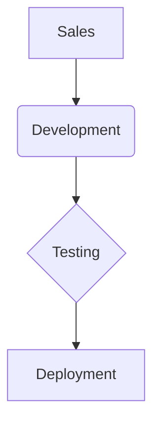

# `docusaurus-prerender-mermaid`

[](https://www.npmjs.com/package/docusaurus-prerender-mermaid)

A Docusaurus plugin that pre-renders your Mermaid diagrams into static SVG or PNG images at build time.

This solves common issues with client-side Mermaid rendering, such as slow performance, content layout shift (CLS), and especially the accessibility and SEO problems caused by missing `alt` text, captions, text descriptions and poor semantic HTML structure.

## What is this and Why?

By default, Docusaurus and `@docusaurus/theme-mermaid` render diagrams on the client side. This means every visitor's browser has to run the Mermaid.js library to parse your diagram text and turn it into an image.

This approach has several problems:

- **Poor Performance:** It adds extra JavaScript to your site, increasing load times.
- **Layout Shift:** A flash of unstyled code appears before the diagram renders, causing your page content to "jump" (a bad Core Web Vital score).
- **No Static Export:** Diagrams don't appear in RSS feeds, social media previews, or other non-JS environments.
- **Accessibility Issues:** The client-side renderer doesn't add `alt` text or captions, making diagrams inaccessible to screen readers. It also doesn't use semantic HTML elements like `<figure>` and `<figcaption>` and it is impossible to link to external text descriptions by using `aria-describedby`.
- **SEO Problems:** Search engines can't index the content of your diagrams, potentially hurting your SEO.

This plugin fixes all of that by doing the rendering **once** at build time (`npm run build`). It generates static `` tags, resulting in a lightning-fast, zero-layout-shift experience for your users. For accessibility, it wraps each diagram in a proper `<figure>`, and supports captions in `<figcaption>`, `alt` text, and `aria-describedby` for text descriptions.

## Features

- **Static Rendering:** Converts ` ```mermaid ` blocks into static `` tags.
- **Dark/Light Mode Support:** Automatically renders light and dark versions of your diagrams based on your Docusaurus theme settings.
- **Accessible:** Generates an HTML `<figure>` wrapper with `` and `<figcaption>` for screen readers, filling out `alt` text, caption and `aria-describedby` using your diagram's metadata.
- **Metadata Support:** Use a frontmatter-like block inside your diagram to add an `id`, `alt` text, `caption`, and link to a text description via `aria-describedby`.
- **Fully Configurable:** Integrates directly with your `docusaurus.config.ts`, including `themeConfig.mermaid`.
- **Caching:** Already-rendered diagrams are skipped, making subsequent builds fast.
- **Customizable Output:** Choose between SVG and PNG formats, set output directories, and pass custom arguments to the Mermaid CLI.
- **Concurrency Control:** Configure how many diagrams to render in parallel for optimal build performance.

## How it Works

The plugin operates in three stages:

1.  **Build Time (Main Plugin):**
    - Scans your content directories (`docs`, `blog`, etc.) for all ` ```mermaid ` blocks.
    - Reads your `docusaurus.config.ts` to find your light and dark theme names for Mermaid. If you have `mermaid.config.json` file, it uses the settings from there instead of `docusaurus.config.ts`.
    - If your color mode switch is disabled via `themeConfig.mermaid.disableColorMode`, it only renders the one default theme defined in `themeConfig.colorMode.defaultMode`.
    - It calls `@mermaid-js/mermaid-cli` (`mmdc`) to render two images for each diagram (e.g., `diagram-de-light.svg` and `diagram-de-dark.svg`) if the theme switch is enabled, or just one image if disabled.
    - It saves these images to the `static/img/diagrams` directory (or your configured `outputDir`).
    - Caches rendered diagrams to speed up future builds.
    - When Docusaurus starts the build process, it copies these images from `static/` to the final `build/` directory automatically.

2.  **Content Transformation (Remark Plugin):**
    - During the Markdown-to-HTML conversion, the remark plugin intercepts the ` ```mermaid ` block.
    - It replaces the code block with an HTML `<figure>` structure.
    - Inside the figure, it inserts two `` tags pointing to the static files (or one, if the theme switch is disabled).
    - `prerender: false` diagrams are skipped and left as-is for the client-side renderer.
    - It fills out accessibility attributes like `alt`, `aria-label`, and `aria-describedby` using the metadata provided in the diagram block.
    - If a caption is provided, it adds a `<figcaption>` element below the images.
    - In the dev mode (`npm run start`), it shows the original mermaid renderer for live previewing and faster edits, which are modified with the same structure as the static output using `<figure>`, ``, and `<figcaption>` to match the build output as closely as possible.

3.  **Client Side (Browser):**
    - The plugin injects a tiny CSS file that uses Docusaurus's `[data-theme='dark']` attribute to show the correct `` and hide the other one. This switch is instant and requires zero JavaScript.

## Installation

You need to install the plugin from the npm registry:

```bash
# With npm
npm install docusaurus-plugin-mermaid-static

# With yarn
yarn add docusaurus-plugin-mermaid-static
```

## Setup

You must add the plugin to **two** places in your `docusaurus.config.ts`:

1.  The main plugin in the root `plugins` array.
2.  The remark plugin in your docs/blog/pages preset options.

```typescript
// docusaurus.config.ts
import type { Config } from '@docusaurus/types';
// 1. Import the remark plugin
import remarkMermaidStatic from 'docusaurus-plugin-mermaid-static/remark';

const config: Config = {
  // ...
  i18n: {
    defaultLocale: 'de',
    locales: ['de', 'en', 'ru'],
  },

  themeConfig: {
    // ...
    // The plugin reads this config automatically!
    mermaid: {
      theme: { light: 'neutral', dark: 'dark' },
      options: {
        fontFamily: 'Arial, sans-serif',
      },
    },
  },

  // 2. Add the main plugin
  plugins: [
    [
      'docusaurus-plugin-mermaid-static',
      {
        // Plugin options...
        contentPaths: ['docs', 'legal'], // Dirs to scan
        outputDir: 'static/img/diagrams', // Where to write SVGs
        outputFormat: 'svg', // 'svg' or 'png'
        // concurrency: 4, // How many to render at once. Defaults to CPU count
        mmdcArgs: ['-b', 'transparent'], // Extra mmdc args
        // other options...
      },
    ],
    // ... other plugins
  ],

  presets: [
    [
      'classic',
      {
        docs: {
          // 3. Add the remark plugin
          beforeDefaultRemarkPlugins: [remarkMermaidStatic],
          // ... other docs options
        },
        blog: {
          // 3. Add the remark plugin (if you use mermaid in blog)
          beforeDefaultRemarkPlugins: [remarkMermaidStatic],
          // ... other blog options
        },
        // ...
      } satisfies Preset.Options,
    ],
  ],
};

export default config;
```

## Configuration Options

All options are optional and are passed to the main plugin in `docusaurus.config.ts`.

| Option           | Description                                                                                                                  | Default                              |
| :--------------- | :--------------------------------------------------------------------------------------------------------------------------- | :----------------------------------- |
| `contentPaths`   | An array of content directories to scan for diagrams, relative to `siteDir`.                                                 | `['docs', 'blog']`                   |
| `outputDir`      | The directory to output rendered images to, relative to the **`static`** directory.                                          | `'img/diagrams'`                     |
| `outputFormat`   | The output format. Can be `'svg'` or `'png'`.                                                                                | `'svg'`                              |
| `configFile`     | Path to a physical `mermaid.config.json` file. If provided, this **overrides** `themeConfig.mermaid.config` for base styles. | `'mermaid.config.json'`              |
| `concurrency`    | The number of diagrams to render concurrently.                                                                               | `os.cpus().length`                   |
| `mmdcArgs`       | An array of additional string arguments to pass to the `mmdc` CLI.                                                           | `['-b', 'transparent']`              |
| `outputSuffixes` | The suffixes to append for light and dark themes.                                                                            | `{ light: '-light', dark: '-dark' }` |

## Configuration Examples

### Default (Minimal) Configuration

If you are happy with all the defaults, you just need to register the plugin. The remark plugin needs no options.

```typescript
// docusaurus.config.ts
import remarkMermaidStatic from 'docusaurus-plugin-mermaid-static/remark';

const config: Config = {
  // ...
  plugins: [
    'docusaurus-plugin-mermaid-static',
    // ...
    [
      '@docusaurus/plugin-content-docs',
      {
        id: 'your-custom-id',
        path: 'your-custom-path',
        // ...
        beforeDefaultRemarkPlugins: [remarkMermaidStatic],
      },
    ],
  ],

  presets: [
    [
      'classic',
      {
        docs: {
          beforeDefaultRemarkPlugins: [remarkMermaidStatic],
          // ...
        },
        // ...
      },
    ],
  ],
};
```

### Advanced (Complete) Configuration

This example changes the content directories, output path, and adds a custom scale factor to `mmdc`.

```typescript
// docusaurus.config.ts
import remarkMermaidStatic from 'docusaurus-plugin-mermaid-static/remark';

const config: Config = {
  // ...
  plugins: [
    [
      'docusaurus-plugin-mermaid-static',
      {
        contentPaths: ['docs', 'legal', 'src/pages'],
        outputDir: 'static/assets/mermaid',
        outputFormat: 'png',
        concurrency: 4,
        mmdcArgs: ['-b', 'transparent', '--scale', '1.5'],
      },
    ],
    // ...
  ],

  presets: [
    [
      'classic',
      {
        docs: {
          beforeDefaultRemarkPlugins: [remarkMermaidStatic],
          // ...
        },
      },
    ],
  ],
  // ...
};
```

## Mermaid Metadata

You can add a metadata block (similar to frontmatter) to the **top** of any ` ```mermaid ` block. This gives you fine-grained control over accessibility and styling.

### Available Metadata Fields

- **`id`**: (String) Sets the HTML `id` for the `<figure>` tag. If not provided, a 10-character hash of the diagram code is used. This ID defines the name of the output image files as well.
- **`alt`**: (String) **Highly recommended.** Sets the `alt` text for the `` tags. This is crucial for accessibility. Make sure to describe the diagram meaningfully, but not longer than 160 characters.
- **`caption`**: (String) Adds a `<figcaption>` element below the diagram.
- **`width`**: (String) Sets the `width` attribute on the `` tags (e.g., `600px`). This helps when rendered images are too large on desktop.
- **`prerender`**: (`false`) If you set `prerender: false`, this plugin will **skip** this diagram entirely, leaving it for the client-side `@docusaurus/theme-mermaid` to render.
- **`descriptionId`**: (String) An advanced accessibility feature. Links the figure to an external description via `aria-describedby`. This is essential for WCAG compliance for complex diagrams. The value should be the `id` of an existing HTML element on the page that contains the description text.

### Example

Here is how you would write a diagram in your `.md` or `.mdx` file:

**Input (`my-doc.mdx`):**

````markdown
Here is our company process:


````

**Output (Simplified HTML at build time):**

```html
<figure id="company-flow" class="static-mermaid-figure">
  
  

  <figcaption id="company-flow-caption">
    The official company development process.
  </figcaption>
</figure>
```

## Styling Guide

The diagrams come without any default styling, so you can style them to fit your site's design.

- `.static-mermaid-figure`: The main `<figure>` wrapper.
- `.mermaid-light`: The `` tag for the light theme.
- `.mermaid-dark`: The `` tag for the dark theme.
- `figcaption`: The caption element.

### SCSS Styling Example

Here is an advanced example (using SCSS) to add a background, border-radius, and custom-numbered counters to your figures.

```scss
// In your custom.scss file

.markdown .static-mermaid-figure {
  // Add a counter for each figure
  counter-increment: figurecounter;

  margin: 2rem 0;
  display: flex;
  flex-direction: column;
  align-items: center;
  gap: 0.5rem; // Space between image and caption

  // Style the image tags
  & > img {
    max-width: 100%;
    max-height: 100%;
    padding: 1.5rem;
    background-color: var(--ifm-card-background-color);
    border-radius: 0.75rem;
    border: 1px solid var(--ifm-color-emphasis-300);
  }

  // Style the caption
  & > figcaption {
    margin-top: 0.25rem;
    font-size: 0.9rem;
    color: var(--ifm-font-color-secondary);
    font-style: italic;
    text-align: center;

    // Example of a custom "Figure 1.1: " counter
    &::before {
      content: 'Figure ' counter(h2counter) '.' counter(figurecounter) ': ';
      font-weight: 600;
      color: var(--ifm-font-color-base);
      font-style: normal;
    }
  }
}
```

## License

This plugin is released under the [MIT License](./LICENSE). You are free to use, modify, and distribute it as you see fit.

## Contributing

Contributions are welcome! If you find a bug or have a feature request, please open an issue on the [GitHub repository](https://github.com/musnuss/docusaurus-prerender-mermaid).
